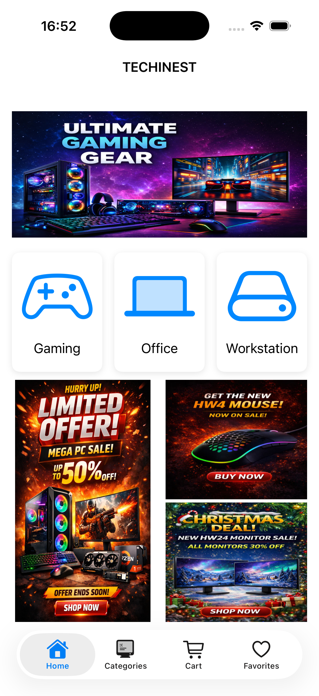
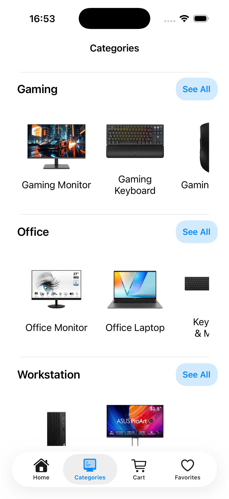
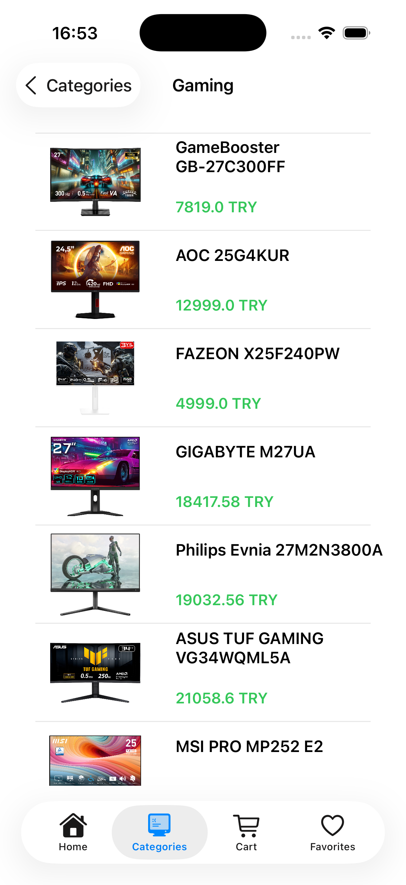
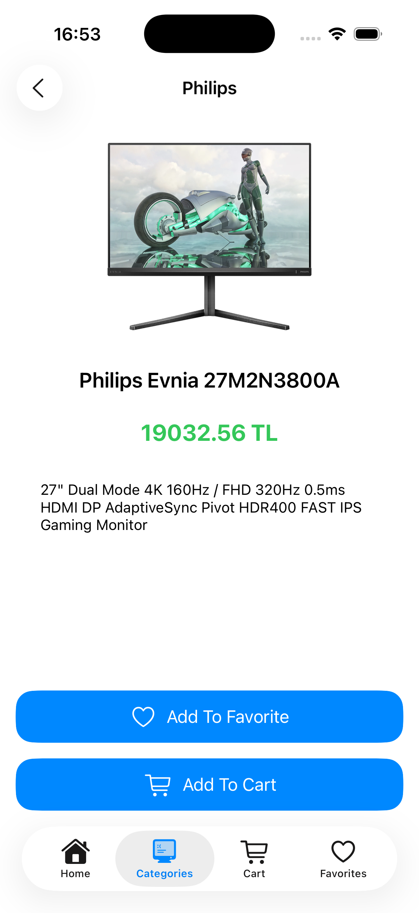
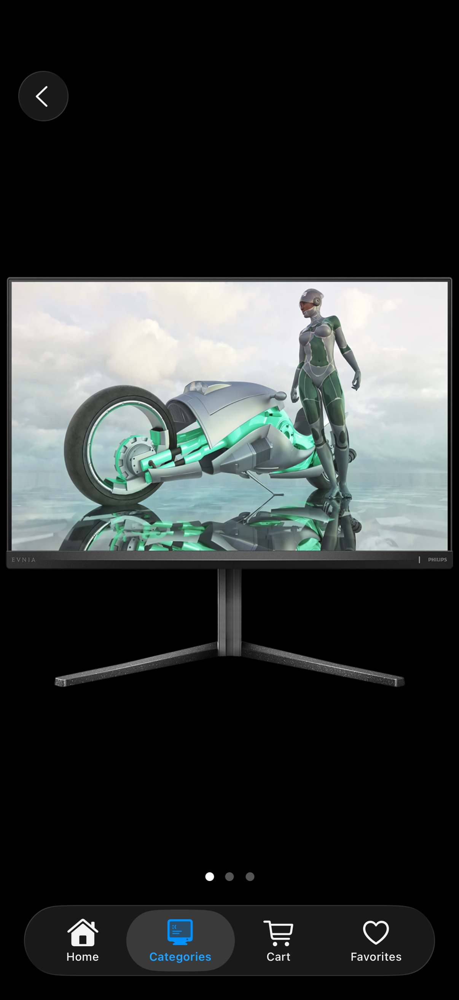
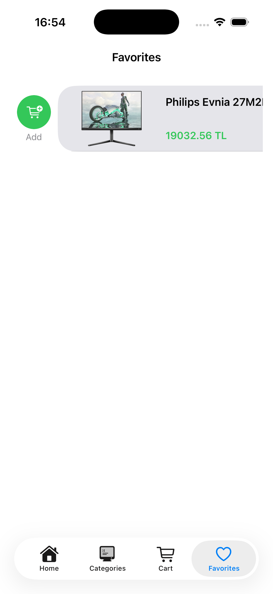
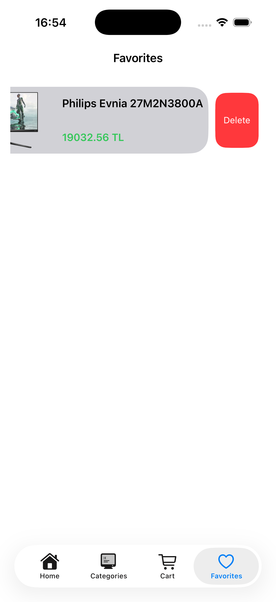
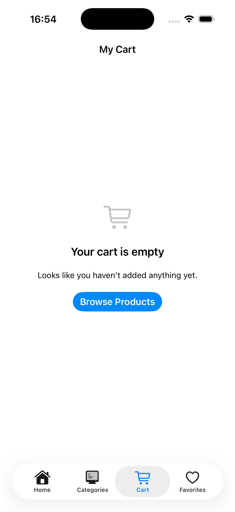

# 🖥️ iOS Computer Market

<p align="center">
  
  
  
  
  
</p>

<p align="center">
  <strong>📚 iOS Programming Course - Term Project</strong><br/>
  <em>A modern e-commerce application for computer hardware and peripherals</em>
</p>

<p align="center">
  
  
  
  
</p>

---

## 📸 Screenshots

<p align="center">
  
  
  
  
</p>

<p align="center">
  
  
  
  
</p>

## 📱 About

iOS Computer Market is a fully functional e-commerce mobile application built with Swift and UIKit. The app allows users to browse, filter, and purchase computer hardware products across three main categories: **Gaming**, **Office**, and **Workstation**.

> **📚 Course Project**  
> This project was developed as a **term project** for the **iOS Programming** course. It demonstrates proficiency in iOS development concepts including network requests, data parsing (XML & JSON), local storage with Core Data, and modern UI/UX practices.

---

## ✨ Features

### 🛍️ Product Browsing
- **Three main categories**: Gaming, Office, and Workstation products
- **Hierarchical navigation**: Categories → Subcategories → Products
- **Rich product details**: Multiple images, descriptions, and pricing

### ❤️ Favorites System
- Add/remove products from favorites
- Persistent storage with Core Data
- Quick add to cart from favorites list

### 🛒 Shopping Cart
- Add products to cart
- Swipe-to-delete functionality
- One-tap checkout simulation
- Running total calculation

### 🖼️ Image Gallery
- Multi-image product gallery
- Image caching with Kingfisher
- Smooth scrolling and transitions

### 📊 Data Management
- **XML parsing** for category hierarchy (SWXMLHash)
- **JSON parsing** for product data (SwiftyJSON)
- **Core Data** for local persistence (Favorites & Cart)

---

## 🛠️ Tech Stack

| Technology | Purpose |
|------------|---------|
| **Swift 5** | Primary programming language |
| **UIKit** | User interface framework |
| **Core Data** | Local data persistence |
| **Kingfisher** | Image downloading and caching |
| **SWXMLHash** | XML parsing for categories |
| **SwiftyJSON** | JSON parsing for products |
| **URLSession** | Network requests |

---

## 📂 Project Structure

```
IOS_Computer_Market/
├── OmerFarukAsil_Project/
│   ├── OmerFarukAsil_Project/
│   │   ├── MainVC.swift                 # Home screen with category selection
│   │   ├── CategoriesVC.swift           # Category listing view
│   │   ├── ProductsVC.swift             # Products grid/list view
│   │   ├── ProductDetailVC.swift        # Product detail page
│   │   ├── CartVC.swift                 # Shopping cart management
│   │   ├── FavoriteVC.swift             # Favorites list
│   │   ├── ImageGalleryVC.swift         # Image carousel view
│   │   ├── DataSoruce.swift             # Data fetching & parsing
│   │   ├── Category.swift               # Category model
│   │   ├── Product.swift                # Product model
│   │   ├── SWXMLHash.swift              # XML parsing library
│   │   ├── SwiftyJSON.swift             # JSON parsing library
│   │   └── Assets.xcassets/             # App icons & images
│   └── OmerFarukAsil_Project.xcodeproj
│
└── Data/
    ├── categories.xml                    # Category hierarchy data
    ├── gaming_laptop.json               # Gaming laptops products
    ├── gaming_keyboard.json             # Gaming keyboards
    ├── gaming_mouse.json                # Gaming mice
    ├── graphics_card.json               # GPUs
    ├── cpu.json                         # Processors
    ├── ram.json                         # Memory modules
    ├── ... (other product JSONs)
    └── IMG/                             # Product images
        ├── laptop/
        ├── gpu/
        ├── keyboard/
        └── ...
```

---

## 🚀 Getting Started

### Prerequisites

- macOS Monterey (12.0) or later
- Xcode 15.0 or later
- iOS 15.0+ deployment target

### Installation

1. **Clone the repository**
   ```bash
   git clone https://github.com/Omieron/IOS_Computer_Market.git
   cd IOS_Computer_Market
   ```

2. **Open the project**
   ```bash
   open OmerFarukAsil_Project/OmerFarukAsil_Project.xcodeproj
   ```

3. **Build and Run**
   - Select your target device/simulator
   - Press `Cmd + R` to build and run

---

## 📦 Product Categories

### 🎮 Gaming
| Subcategory | Products |
|-------------|----------|
| Peripherals | Monitors, Keyboards, Mice, Headsets |
| PC Components | CPUs, RAM, Graphics Cards, Motherboards, Cases |
| Systems | Gaming Laptops, Pre-built Gaming PCs |

### 💼 Office
| Subcategory | Products |
|-------------|----------|
| Office Products | Monitors, Laptops, Keyboard & Mouse Combos |

### 🔧 Workstation
| Subcategory | Products |
|-------------|----------|
| Professional | Workstation PCs, Professional Monitors |

---

## 🎯 Key Learning Outcomes

This project demonstrates proficiency in:

- **MVC Architecture** - Clean separation of concerns
- **UITableView & UICollectionView** - Dynamic content display
- **Core Data** - CRUD operations for local persistence
- **Network Layer** - Async data fetching with URLSession
- **Data Parsing** - XML and JSON processing
- **Image Caching** - Efficient image loading with Kingfisher
- **Haptic Feedback** - Enhanced user experience
- **Storyboard & Auto Layout** - Responsive UI design

---

## 👨‍💻 Author

**Ömer Faruk Asil**

- GitHub: [@Omieron](https://github.com/Omieron)

---

## 📄 License

This project is licensed under the MIT License - see the [LICENSE](LICENSE) file for details.

---

## 🙏 Acknowledgments

- Product images sourced for educational purposes
- [Kingfisher](https://github.com/onevcat/Kingfisher) for image caching
- [SWXMLHash](https://github.com/drmohundro/SWXMLHash) for XML parsing
- [SwiftyJSON](https://github.com/SwiftyJSON/SwiftyJSON) for JSON parsing

---

<p align="center">
  <strong>📚 Developed as a Term Project for iOS Programming Course</strong><br/>
  Made with ❤️ using Swift & UIKit
</p>
